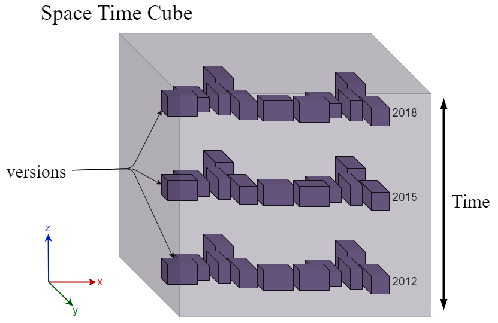

# Comité de suivi de thèse 

Information sur le CST [ED info/math](http://edinfomaths.universite-lyon.fr/comite-de-suivi-individuel/)
Date CST : 22/05/2023
- [Topic meeting](../../../Topic_Meetings/2023/2023_02_20_Point_CST_DVA_CGA.md)

## Introduction
Ma thèse a débuté en octobre 2022, dans le cadre du projet TIGA une des actions de l’appel à projet de l’Etat du programme « Territoires d’Innovation ». L’action est pilotée par l’Université de Lyon en particulier par le Labex IMU et porte sur le prototypage, l’expérimentation et la valorisation de méthode et d’outils pour la médiation industrielle. Dans ce contexte, mon sujet de thèse a pour objectif de développer de nouvelles modalités de représentation du territoire à la fois tangible, numérique et dynamique.  La thèse est co-encadrée par Gilles Gesquière (Origami) et Johanna Delanoy (Origami).

## Résumé des travaux effectués
Les jumeaux numériques se font de plus en plus nombreux pour décrire facilement un territoire. Nous voulons améliorer ces dispositifs de médiation en ajoutant plus d’information qu’une représentation 3D des bâtiments. 

Une première idée pour améliorer les jumeaux numériques est l’intégration de contenu multimédia tel que des documents, vidéos, images d’archives ou interview. Ces supports sont une autre manière de décrire une ville et combiner les deux modes de représentation permettent de contextualiser le modèle 3D de bâtiment. J’ai réalisé un état d’art sur les travaux d’intégration de document dans des modèles de ville. Nous avons remarqué que les approches proposées n’intégraient pas forcement tout type de multimédia ou n’était pas adapté pour un modèle 3D de ville. Nous avons proposé quatre méthodes d’intégration de contenu multimédias dans une scène 3D géospatiale. Ces méthodes nous permettent de gérer les contenus vidéos/images/interviews/document tout en le liant aux données urbaines géospatiales et ainsi décrire une ville sous différent format. Ces travaux de recherche ont été publié à la conférence internationale 3DGeoInfo & SDSC 2022  et ont été présenté à Sydney le 20/10/2022.

La représentation numérique nous permet d’avoir un outil de perception de la ville plus accessible avec son support web. Toutefois les maquettes physiques sont des outils qui ont fait leur preuve dans des musées pour la médiation autour d’une thématique. Nous avons observé que des travaux du MIT produisent des maquettes lego d’un territoire pour designer la ville du futur. Après les travaux d’intégration de multimédia, nous nous sommes inspirés de ces maquettes tangible pour produire la nôtre à l’aide des données 3D géospatiales des bâtiments. Nous avons développé un algorithme permettant de prendre de la donnée 3D géospatiale en entrée pour la transformée en grille CSV à l’aide de la technique de lancés de rayons. Ainsi nous avons pu reproduire le quartier Gratte-ciel de Lyon en lego dans le contexte de la semaine de l’anthropocène avec sa thématique « A quoi rêvent les maquettes ? ».  La maquette est composée de la représentation tangible du quartier en lego blanc et d’un pied et son vidéo projecteur pour projeter de la donnée 2D. La projection permet de donner plus d’information que sa représentation spatiale comme par exemple la projection d’ilot de fraicheur sur le quartier ou alors le réseau de transport en commun. Ce nouvel outil de médiation qui était mis à disposition de groupe d’étudiants pluridisciplinaires nous a permit de nous rendre compte de la capacité de médiation que peut avoir une maquette tangible d’une ville.

  Ensuite, nous nous sommes intéressés à la représentation l’évolution de la donnée 3D pour mieux comprendre comment a évolué une ville. Plusieurs approches représentent la ville à instant t, notamment les travaux de Jaillot. Toutefois, elles ne montrent pas l’ensemble de l’évolution dans une même évolution et d’avoir une vision global des changements. Nous avons amélioré cette représentation en l’intégrant à la représentation du Space-Time cube que le monde de la géomatique utilise afin de répondre à cette problématique. Pour cela, nous avons superposé des niveaux temporels dans la représentation qui représentent la couche de donnée 3D à un instant t (Figure 1). Entre chaque niveau, nous intégrons des liens de couleur qui relient la géométrie d’un bâtiment au cours du temps. Ces liens sont colorés en fonction de l’état de transaction de la donnée (Détruit en rouge, Modifié en jaune et Construit en vert). Ces travaux ont été proposés à la 27th International Conference Information Visualisation et sont en attentes de validation.

|  |
| :--- |
| *Figure 1* : Donnée urbaine 3D intégrée dans la représentation du Space-Time cube, avec le temps le long de l’axe z dans l’espace 3D. Les différentes versions de la donnée sont placées les unes aux dessus des autres. L’axe du temps peut être du bas vers le haut et inversement dans l’espace. |

## Perspectives pour la deuxième année
   L’intégration de multimédia dans un modèle 3D numérique de la ville permet une annotation des bâtiments ou d’un quartier. Les prochains travaux sont de combiner la représentation évolutive de la ville avec ce contenus multimédia pour donner plus de contexte à des changements dans la ville. Par Example placer les schémas d’architecte qui justifie la destruction de certain bâtiment à la couche de donnée correspondant à la date de destruction. Pour la maquette Lego, nous voulons un expérimenter des représentations de la ville sous différents niveaux d’échelles en fonction du discours qu’on souhaite raconter autour de cet outil de médiation.
## Valorisation / Formations scientifiques
### Publications
- 3D GeoInfo / SDSC : [Integrating multimedia document in 3D city model for a better understanding of territories](https://hal.science/hal-03852790/) (19-21/10/2022)
- Mappemonde : [UD-SV : Plateforme d’exploration de données urbaines à n-dimensions — Espace, Temps, Thématiques](https://journals.openedition.org/mappemonde/8265) (11/04/2023)
- (*En cours*) International Conference Information Visualisation: Representation of urban geometry evolution through space-time cube

### Séminaires/Réunions
- (*Présentation*) [Challenge GeoDatadays 2022:](https://www.geodatadays.fr/page/GeoDataDays-2022-Les-Challenges-Geodata/113) UD-SV (14/09/2022) **Premier prix du Jury**
- (*Présentation*) [MAGIS-AP3D:](https://github.com/VCityTeam/MAGIS-AP3D/blob/master/Media/README.md) Intégration de multimédia dans une maquette 3D de la ville pour une meilleur compréhension des territoires (06/04/2023)
- (*Participation*) [Origami](https://projet.liris.cnrs.fr/origami/index.html) - Mondes Virtuels: groupe de lecture autour de la génération procédurale de terrains (Toutes les 3 semaines)
- (*Participation*) [Journée d'étude : La boite à outils de cartographie et de la géovisualisation de données](https://github.com/magisAR9/JEGeovizRennes) (06/01/2023)
- (*Participation*) Journée des doctorants ED Info/Math Lyon: présentation des sujets de thèse des D2. (23/02/2023)

### Ateliers
- [Semaine de l'anthropocène "A quoi rêvent les maquettes ?"](https://ecoleanthropocene.universite-lyon.fr/a-quoi-revent-les-maquettes--289281.kjsp?RH=2023prog): Développement d'une maquette augmentée du quartier Gratte-ciel,  mise à disposition pour des étudiants pluridisciplinaires ([Page projet](../../Anthropocene_2023/Readme.md)). (23-27/01/2023)
- [Festival pop'sciences 2023](https://popsciences.universite-lyon.fr/le_festival/) : Développement d'une maquette hybride de la vallée du Gier ([Page projet](../../Rive-De-Gier_Maquette/Readme.md)). (12-14/05/2023)

### Formations doctorales
- Que faire avec un doctorat en Informatique ? Valorisation des compétences acquises pendant le doctorat pour une multiplicité de carrières (13/12/2022)

## Encadrement/Enseignement
- GAMAGORA DU Infographiste: initiation à la programmation. Le programme est du scripting Blender, des cours de Scratch et de la programmation d'un jeu vidéo dans Unity. (40h)
- Beyond Lego WPI: encadrement d'étudiants du Worcester Polytechnic institute. Leur objectif est de produire un état de l'art des maquettes lego existantes et d'avoir un esprit critique sur les dispositifs trouvés.
