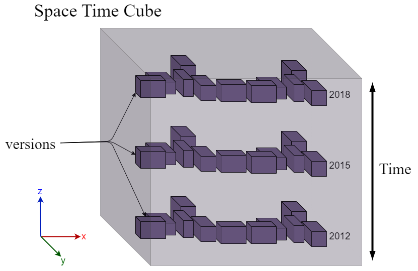

# Representation spatio-temporelles / Morphogénèse
* [Representation of urban geometry evolution through space-time cube](../../../../articles/CGA-Morphogene-2023/main.pdf)
* [ New article for Researcher paper](https://www.overleaf.com/project/664c53a6fb5f9a87624e1eb4)
## TO-DO
### Development: [lien project git](https://github.com/VCityTeam/UD-Viz/tree/space-time-cube)
- [ ] Paramètre de Rotation pour les shapes
- [ ] Paramètre de Scaling pour les shapes

  
## Contexte
Le développement des représentations spatio-temporelles s'inscrit dans l'appel à [projet TIGA](https://www.tank-ssi.org/). L'objectif initial est une nouvelle représentation de l'évolution du travail dans les zone industrielles. Nous avons pris l'exemple de la cité berliet dans la métropole lyonnaise, qui est un site qui a  évolué entre 1950 et 2020. Représenter ce quartier à l'aide d'une visualisation numérique, nous permet d'avoir un outil grand public simplifiant la compréhension de l'évolution du travail. Ce travail est en collaboration avec les travaux de recherche du laboratoire [EVS](https://umr5600.cnrs.fr/fr/accueil/).
## Questionnements 
- Comment représenter l'evolution d'un territoire dans une seule vue ?
- Comment mettre en avant toute l'évolution morphologique d'un quartier dans une même représentation ?
- Comment intégrer le temps dans un espace 3D pour montrer les évolutions ?
- Comment intégrer un modèle de donnée graphe montrant les scènarios possibles d'un quartier dans une scène géospatiale ?
## Planning

- [Gant: juin 2023 - octobre 2023](https://docs.google.com/spreadsheets/d/1aVUnufKKo662R-H05JiyyIEc9hJiwEeWAi-l_3aliM0/edit#gid=0)
- [Gant: novembre 2023 - mars 2024](https://docs.google.com/spreadsheets/d/1fKweLAfANyZMbt5Vvuamhm6MKO6nd38kouq5Uo8cQ1E/edit#gid=0)

## Bibliographie 
- [Temporal Bibliographie](./../../Bibliographie.md#temporal-visualisation)
- [Data structure](./../../Bibliographie.md#data-structure)

## Utilisateurs
1. Data Analyste: 
    - Donne une nouvelle manière de comparer la donnée plus rapidement dans une seule vue. La ou dans des outils traditionnel on ne peut comparer que deux donnée simultanément 
    - **Use-case**: Vérification de l'évolution, interaction avec le slider temporel en sélection une intervalle de temps plus restreintes pour être précis dans sa perception de l'évolution.
2. Citoyens: 
    - Habitant du territoire représenté et souhaite découvrir son quartier sous différentes époques.
    - **Use-case**: va intéragir avec le slider et voir toute l'évolution d'un seul coup. 
3. Chercheurs: 
    - Researchers with an evolving graph dataset who wish to visualise it to observe its veracity
    - **Use-case:** Integrate his data in the visualisation process and analyse the graph representation
   
Focus sur les chercheurs, la représentation sera plus adaptée pour leur cas d'utilisation. Ils pourront visualiser leur jeu de données graph et ainsi vérifié les données.  
## Définition
- **Space Time Cube:** Le Space time cube est un mode de représentation de donnée de flux utilisé en géomatiques. Cette représentation permet de visualiser dans un espace 3D avec en coordonées x/y les positions de la donnée et en  axe z le temps. L'intégration du temps permet de visualiser l'évolution au court du temps une donnée de flux (par example le trajets habitation / travail d'un usager). Ce Space time cube est principalement utilisé pour cette donnée de flux et est très peu utilisé avec de la géometrie 3D de bâtiments. Dans notre cas nous avons intégré des données 3D urbaines dans le STC. Chaque millésimes de la donnée est disposé le long de l'axe z tout en gardant l'information de sa hauteur. 
- **Versions**: Etat de la donnée urbaine à un instant t (Samuel et al.). Dans le contexte du STC, une version est une représentation de la ville à une date qui peut avoir différentes granularités (mois ou année). Dans des futurs travaux une version dans ce mode représentation peut être également d'autres manière de visualiser une quartier comme des documents d'urbanistes, des vidéos d'archives, des photos etc. 
- **Transactions:** Les etats de transitions entres les versions d'une ville sont appelés **transaction**. Les transactions sont définis par 3 types qui sont lié au modifications de la donnée:
  - Construction: Apparition de géometrie entre les versions V<sub>i</sub> et V<sub>i+1</sub>.
  - Destruction: Disparition de géometrie à la position d'un bâtiments de la version V<sub>i</sub> à V<sub>i+1</sub>. 
  - Modification: Une modification de la géometrie qui a été detecté entre deux versions. Cela peut être un bâtiment plus détails ou la suppression d'une partie de la géometrie 3D.

## Conception
### Shapes of timelines
### Positionning of versions
### Orientation/Scaling
### Temporal level
Les versions de la ville sont appelées level temporel dans notre représentation. Ces levels sont une représentation de la ville à instant t et peut être sous différentes formes. Le but de ce level est de représenté la ville à instant t sous différent format qui décrit un territoire. L'interet d'avoir cette liste de représentation permet d'aider à la compréhension de la ville mais aussi de son évolution qui peut être sous la forme de document d'urbanisation ou de photo d'archive.

Chaque temporel level ont une position dans l'espace lié à la date de leur représentation de la ville. 
La géometrie du quartier garde ses positions x/y mais seront élevé en z, lié au temps. 

La position du temporel est calculé en fonction du temps et s'ajoute à cela un coefficient delta. Ce coefficient est calculer en fonction de la bouding box de la géometrie. Il permet d'ajouter de l'espace entre les levels pour les quartiers qui comportent des bâtiments avec une hauteur élevé (gratte-ciel) et faire en sorte que la géometrie de superpose pas.

$P_{STC} = T(t_i)*P_{world}$

$T(t_i)$ : la matrice de transformation des levels temporels est pensé, dans notre cas, à une translation sur l'axe z. Mais nous pouvons réflechir à une nautre manière de placer les levels dans l'espace pour qu'il soit plus adapater à la vue.
* [idées de transformation](./Transformation4D.md)

Une fois les "levels" disposés dans l'espace, il nous fallait mettre en avant les types de changement qu'il peut avoir entre les versions afin d'améliorer la visibilité de l'évolution. 

### Etat de changement / Transactions
En complément du travail de VJA et de sa représentation à instant t, Nous réutilisons les trois types de transactions creation/modification/demolition. 

| De Luca et al.  | Jaillot et al. |
|--------------------------|------------------------------|
| creation | creation |
| modification | modification |
| demolition | demolition |
| reconstruction |  |

**Livio De Luca**, Chawee Busarayat, Chiara Stefani, et al. “An iconography-based
modeling approach for the spatio-temporal analysis of architectural heritage”.
In: 2010 Shape Modeling International Conference. IEEE, 2010, pp. 78–89 (cit. on
pp. 22, 23). 

Pour améliorer la visualisation de ce flux de donnée, des liens symboliques entre les millésimes de la géométrie permettent de suivre plus facilement son évolution en y ajoutant également de la couleur pour mettre en avant les transactions. Ces liens pointent sur le centroide des bâtiments identifié par leur GMlId et ainsi retracer l'évolution plus rapidement.
Construction        |  Destruction | Modify           |  Unchanged
:-------------------------:|:-------------------------:|:-------------------------:|:-------------------------:|
    |   |   |  |
<!-- #### Example
 -->

### Représentations spatio-temporelles
[4 modes de représentations](./Mode_Representations.md)
<!-- #### Space time cube
Le time space cube ou time geography est principalement utilisé pour des données de flux tel que le trajets des travailleurs de leur lieu d'habitat à leur lieu de travail. Cela permet d'indiquer si les travailleurs sont éloignés de leur entreprise et combien de temps restent-ils sur certains points dans l'espace. Nous voulons reprendre cette représentation du temps mais en l'applicant à de la donnée 3D.L'utiliser sur de la géometrie nous permet d'avoir tout l'historique d'un quartier/territoire dans une même vue.
Cette représentation permet d'intégrer la notion de temps dans une scène 3D géospatiale et ainsi garder la géolocalisation de la donnée. Le temps est représenté sur l'axe verticale (ici z). Il peut être dans les deux directions possible en fonction de comment nous voulons interpréter l'évolution. De la plus ancienne donnée (z le plus petit) à la plus récente qui est la dernière couche du STC en hauteur.

|  | 
|:--:| 
| Figure n: Time Space cube representation with 3D urban data models |

Le décalage entre chaque couche serait proportionnels à leur temporalité, plus l'intervale de temps est grand entre deux versions plus ils seront éloignés dans l'espace 3D sur l'axe verticale -->


## Développement 
### UML

### Donnée de graphe
- Comment est structuré les données de graphe ?
Données utilisées dans le use-case Gratte-ciel: https://dataset-dl.liris.cnrs.fr/rdf-owl-urban-data-ontologies/Datasets/GratteCiel_Workspace_2009_2018/3.0/Transition_2009_2009b.ttl
- Utilisation du graph de vincent sur les transactions avec un scénario et pour les changement entre scénario utiliser le graph de DVA
- Transactions types
https://github.com/VCityTeam/VCity/blob/master/articles/IJGIS-Vinasco-Alvarez-2021/figures/appendix-workspace-model.png


### Slider temporel
Une grande partie des sliders temporels permettent de visualiser l'état de la donnée à un instant t et c'est l'utilisateur qui fait sa propre comparaison entre les données d'époques différentes. Une approche à double entrée afficherait la donnée sur une intervale de temps et montrerait les évolutions de celle-ci. En reprennant la méthode de ...., ce double slider affichent les multimédias dans la scène 3D mais également sur la barre temporel. Nous voulons reprendre cette méthode en l'appliquant sur les millésimes de la géometrie 3D de bâtiments et en l'améliorant avec une visualisation des scénario possibles d'urbanisation d'un quartier. 


## Use-case
### Gratte-ciel
* Données bâtiments: [3DTiles 2009-2018](https://dataset-dl.liris.cnrs.fr/three-d-tiles-lyon-metropolis/Temporal/Villeurbanne_GratteCiel_Temporal_2009-2012-2015-2018_TileSet/)
* Données graph: [RDF urban ontologies](https://dataset-dl.liris.cnrs.fr/rdf-owl-urban-data-ontologies/Datasets/GratteCiel_Workspace_2009_2018/)


Construction        |  Destruction | Modify           |
:-------------------------:|:-------------------------:|:-------------------------:|
    |   |   |

<!-- ### Implementations
 -->

### Fake Data
Création de fausses données pour illustrer la visualisation des formes de timelines. Six versions de 4 bâtiments juxtaposés ont été créé afin de simuler des changements de modification, creation et demolition sur un petit jeu de donnée. 
Ces données ont été créer sur blender à partir de cube. Les cubes ayant des changements ont été coloré en fonction du type de chanegment opéré. 
* [Données obj](https://partage.liris.cnrs.fr/index.php/apps/files/?dir=/VCity/Data/Obj/FakeData&fileid=203188594)

```bash
obj-tiler -i ./pathToFolder/name.obj --add_color --offset 1844417.825
242 5173257.038749 180
```

La position ```1844417.825 242 5173257.038749 180``` correspond à la position géospatiale du parc Blandan à Lyon. Nous avons selectionné cette localisation afin de pas se superposer sur d'autres données existantes.  
* [Données 3Dtiles](https://dataset-dl.liris.cnrs.fr/three-d-tiles-lyon-metropolis/Temporal/FakeData/)
### Lyon 1er
* [Données bâtiments]()


## Article
* Conférence [iV23](https://iv.csites.fct.unl.pt/fi/)
* WPI: Article dans un journal scientifique
* [Pacific Graphics](https://pg2024.hsu.edu.cn) DeadLine 7 juin


## Futurs works
Pour ce graphe de scénario nous nous sommes inspirés des graphe de versionning de workspaces. Nous souhaitons représenter ce graphe de transitions dans un slider ou chaque noeud est une version de la donnée. L'utilisateur a la possibilité de selectionner un ensemble de noeud avec une intervale qui s'afficheront dans l'environnement 3D.
 Temporal and proposition visualisation (our proposition)

WPI Temporal slider | Vinasco graph
:-------------------------:|:-------------------------:|
 |  |

