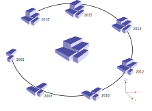
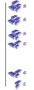
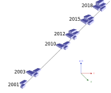

[Article link](https://www.overleaf.com/project/65649b51a37eba5ec464780f)

# TO-DO:
- [X] [Roadmap](https://docs.google.com/spreadsheets/d/1fKweLAfANyZMbt5Vvuamhm6MKO6nd38kouq5Uo8cQ1E/edit#gid=0)

# Mode de représentation
L'objectif est de représenter l'évolution temporelle de la ville en intégrant le temps dans la scène 3D de visualisation de la donnée. Pour ces représentations nous nous basons sur les travaux de ... .  
Pour visualiser cette évolution nous disposons de version de la ville. Une version est un état de la donnée urbaine à un instant $t$ dans le temps. Une version peut être sous différent niveau d'echelle, elle peut aller de la visualisation d'un bâtiments, d'un quartier à une métropole entière.
Dans notre cas une version est composé de l'etat de la donnée à un instant $t$, sa date et les différences de géométrie de la donnée entre la versions $t-1$ et $t+1$. Ces différences sont calculées par la comparaison des cadastres entre 2 versions de la donnée. Un lien symbolique est créer entre deux versions de la donnée pour suivre l'évolution d'un bâtiment. Ce lien est appelé transactions il pointe sur le centroid du bâtiment à chaque version, de plus la couleur du lien dépend du type de changemetn entre les versions. On identifie 3 types de changements, Construction, Destructions et Modification.
Le principe de la méthode de ... est de disposé dans l'espace 3D les versions en suivant une timeline. 
Cette timeline peut être pensé de manière différente qu'une droite dans l'espace.

Nous avons ciblé 4 modes de représentations spatio-temporelles qui font évoluer la timeline. Nous avons fait le choix d'en choisir plusieurs car certains peuvent être plus adapté à l'échelle spatiale de la version et ainsi mieux comprendre son évolution. 
## Paramètres globaux:
* **Espacement entre les versions:** 
    - Séquentiel, la distance entre chaque version reste la même peu importe leur date de création. 
    - Chronologique, l'espace entre les versions est proportionnel à l'espacement en temps. 
    - Pourcentage de changement, La disposition des versions peut dépendre des meta-données. Example: la distance entre les versions peut être calculé en fonction du pourcentage de changements entre $v_n$ et $v_{n+1}$. On perd l'echelle temporelle pour donner un découpage en fonction des différences.
* **Les différences:** Afficher/Cacher les différences dans la représentations spatio-temporel.
* **"Perspectives/sans changer l'orientation":** En fonction du point de vue de l'utilisateur les versions peuvent s'orienter vers la camera tout en gardant son vecteur de direction initial. 

## Cercle
Le premier mode de représentation temporelle est une timeline en forme de cercle. La timeline suit le sens horaire ou anti horaire (en fonction du choix de l'utilisateur) du cercle et dispose les versions le long de celui-ci. 
La forme cercle serait plus adapté pour un petit nombre de versions. Si trop de versions, celles-ci peuvent se superposer dans la disposition en cercle et rendre la représentation illisible.

- **Comportement:** Le cercle fait toujours face à la camera, les versions gardent la même orientation pour pouvoir les comparer avec la version géolocalisée. Le cercle a une élevation supérieur au plan pour mettre en avant seulement la version selectionnée géolocalisée. Le centroid du cercle est décalé dans le sens opposé de la direction de la camera. 
- **Interaction bâtiments:** Lorsque l'utilisateur sélectionne un bâtiments dans la version sélectionné. Le lien entre les différences s'intègre entre la version sélectionné et les versions  $v_{n-1}$ et  $v_{n+1}$ afin de suivre l'évolution du bâtiment. 
- **Interaction cercle:** L'utilisateur peut sélectionner une version dans le cercle temporel. Cette version se place sur le plan géolocalisé et reprend sa taille initiale. Le cercle évolue de manière à mettre en avant la version centrale. Les transactions s'affichent entre $v_{n-1}$ et $v_n$ et également $v_{n}$ et $v_{n+1}$
- **Sens du cercle:** L'utilisateur peut sélectionner entre un sens horaire ou anti-horaire pour la disposition des versions.
- **Paramètres propre à la représentation:** 
    - Rayon du cercle
    - Hauteur du cercle temporel
    - Taille des versions: L'utilisateur peut décider sur lorsqu'aucune version est sélectionnée, les autres versions sont plus petites que la version mise à plat sur le plan géolocalisé. De plus, les versions $v_{n}$, $v_{n-1}$ et $v_{n+1}$ garde leur taille initiale et le reste sont réduites.

- **Données plus adaptées:** Le mode cercle est plus adapté pour une donnée qui comporte peu de version de celle-ci. La disposition des versions est limité par cette forme et si il existe trop de version elles pourraient se supperposer les unes sur les autres et rendre la représentation illisible.  

## Spirale
Un autre mode de représentation est en spirale, il s'inspire du cercle mais ajoute une élévation avec autant de cycle que nécessaire. La versions la plus ancienne se place à l'extrémité basse de la spirale et la version la plus récente à l'extrémité haute. La hauteur de la spirale dépend de l'intervale de temps entre la $v_0$ et $v_{max}$. Contrairement au cercle, elle ne limite pas le nombre de version disposé sur la timeline. La spirale peut être aussi longue que le nombre de version disponibles sur le quartier à visualiser. Elle est ainsi plus adapté pour un plus grand nombre de version et est plus facile à disposer dans l'espace. La posssiblité de mettre un plus grand nombre de version dans cette représentation nous laisse également la possibilité d'ajouter d'autres formes de représentations de la ville. Des contenus multimedias datés décrivant le quartier ou le bâtiment peut être disposé sur cette timeline et compléter les versions de la ville. Les multimédias peuvent être placés de la même manière que les versions et avoir une position dans l'espace 4D. 

- **Comportement:** La spirale reste statique lorsque le point de vue de la camera évolue. Si plusieurs versions sont proches temporellement (jour/mois) une agrégation des versions est alors intégré, de même pour les multimédias. L'utilisateur peut alors sélectionner cette agrégation et élargir la timeline pour visualiser la totatlité des versions/multimédias agrégés. 
- **Paramètres propre à la représentation:**
    - Rayon de la spirale 
    - Espacement en hauteur
    - Agrégation des versions
    - Taille des versions: L'affichage de l'évolution d'une métropole peut être lourd à visualiser sur la timeline. Plus la zone à afficher est grande plus on réduit sa taille le long de la spirale. Nous laissons également le choix à l'utilisateur de choisir cette taille. 
- **Interaction spirale:** Pour les agrégations de versions dans la spirale, l'utilisateur peut selectionner celle-ci et afficher plus en détails les différentes versions en mode cercle. Le centre du cercle se situe à la position ou se trouvait l'agrégation Les versions sur le cerce peut être soit placé chronologiquement ou séquentiellement sur la timeline.
- **Données plus adaptées:** Le mode spirale est plus adapté pour une donnée qui comporte beaucoup de versions de sa capacité à étendre la représentation en hauteur.   

## Ligne
Un troisième mode de représentation est une timeline plus classique en suivant une ligne droite. Le sens de la ligne droite temporelle est du bas vers le haut et donc plaque la version la plus ancienne sur le plan géolocalisé. Cette représentation reprend le principe du Space-Time cube utilisé en géomatique pour visualiser l'évolution de données temporelles. Chaque version est disposée le long de l'axe verticale les unes au dessus des autres. Nous pouvons également apporter un décalage dans le sens opposé de la camera (tout en gardant son orientation initial) afin de donner une profondeur aux versions. Ce décalage permet de mieux percevoir les différentes versions lorsque celles-ci sont de la taille d'un quartier ou plus.
| Classique | Décaler |
| ------- | ------- |
|   |  |
- **Comportement:** Les versions peuvent soit rester statique ou toujours faire face à l'utilisateur. Dans le permier cas, l'utilisateur peut tourner autour du cube temporel pour avoir une analyse plus fine. Dans le second, il permet d'avoir toujours une vision sur l'évolution global de la zone à analyser (à revoir). 
- **Paramètres propre à la représentation:** 
    - Espacement entre les versions.
    - Décalage des versions en fonction du point de vue de l'utilisateur.
    - Rotation des versions en fonction de la camera.
    - Taille des versions: Les versions gardent leur taille initiale.
- **Les transactions:** Les transactions sont affichées sur chaque version de la donnée avec une légérère transparence pour les bâtiments inchangés pour mettre le focus sur les évolutions. 
- **Interactions ligne:** L'utilisateur a deux formes d'interactions possible. Une premiere ou il peut sélectionner un bâtiment dans la versions la plus ancienne plaqué sur le plan et afficher toutes les transactions sur la timeline. Les transactions sont également lié physiquement par une ligne droite de la couleur de la transaction. LA deuxième intéraction est par la sélection des types de transactions à afficher. L'utilisateur peut décider de visualiser seulement les créations de bâtiments dans la représentation spatio-temporelle. 
- **Données plus adaptées:** Le mode ligne est plus adapté pour une donnée qui comporte beaucoup de versions, comme pour la spirale l'axe verticale nous permet plus de possibilité de disposition. Cependant une donnée de la taille d'un quartier ou plus peut rendre cette représentation difficile à analyser. Ce décalage des versions sur l'axe horizontal répondrait à ce problème de lisibilité. Les versions plus anciennes ne seraient pas obstrué par celles-ci qui sont en amont. 
## La parabole 
Un dernier mode de représentation est une timeline de la forme d'une parabole englobant la zone à analyser (shema pour explication). La parabole peut être concave ou convexe en fonction du choix de l'utilisateur. Elle est également bornée de chaque côté de la courbe qui correspond à l'interval de temps des versions de la donnée. Les versions de la donnée sont disposé le long de la parabole avec $v_{0}$ et $v_{max}$ à chaque extremité. La version placé au centre de la courbe et la version de la ville analysée souhaité par l'utilisateur.

- **Comportement:** La courbe est toujours orientée vers le point de vue de la camera. Les versions gardent cependant une orientation fixe pour être constamment comparable à la version géolocalisée.
- **Paramètres propre à la représentation:** 
    - Ouverture de la paraboles, concave qui englobe le point de vue de la camera, convexe qui part dans le sens opposé du point de vue de la camera. 
    - Taille des versions en fonction de leur positionnement sur la parabole des versions
    - Orientations de la parabolles 
- **Taille des versions:** La version analysée et les versions $v_{n-1}$ et $v_{n+1}$ gardent leur taille initiale. Les autres versions non-selectionnées ont une taille plus petite (environ x2) pour mettre en avant la version à analyser.  
- **Les transactions:** Chaque transactions est affichées entre la version sélectionnée et $v_{n-1}$ et $v_{n+1}$.
- **Interactions parabole:** L'utilisateur peut sélectionner une version sur la courbe afin qu'elle se place au sommet et décale les versions sur le timeline. 

## Idées
- Pour chaque version une étiquette de temps est placé à côté de la version pour donner l'indication de temporalitée. 
- Rajouter dans les meta-données , la date de création des versions + le pourcentage de construction/destruction/modification.
- Test qualitatif des modes représentations. Demander les préférences de visualisations spatio-temporelles aux testeurs (différents profils) et permettra d'établir des règles de préférences (Ex: citoyen pref mode cercle avec x en rayon etc...).

# Enquête qualitative
- Comparaison des modes de représentations
- Test sur des jeux de données différentes à echelle différentes. La taille des données visualisées peut être plus adapté à certains modes. 
- Demander les parametrages des modes de visualisations. 
## Objectif de l'étude
- Exprimer quelle représentation spatio-temporelle est plus adapté pour certain types de données. 
- Cibler un quartier spécifique et une évolution marquante dans ce quartier. Example: Le quartier gratte-ciel et la construction du nouveau quartier. Une premier etape de la demolition du lycée. La deuxième la construction des nouveaux bâtiments.
