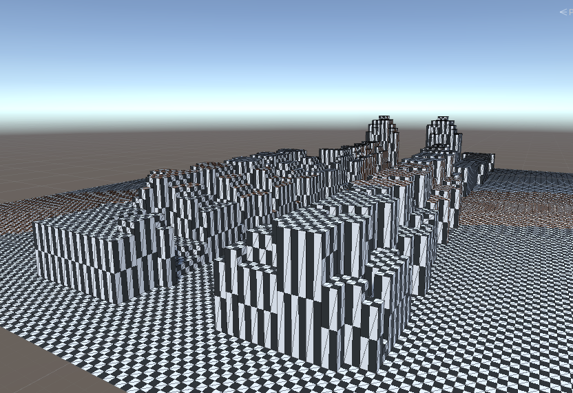

## CityGML Gratte-Ciel 2018
- [Source code](https://partage.liris.cnrs.fr/index.php/apps/files/?dir=/VCity/Data/CityGML/Gratte_Ciel_2009-2018)

## Legonizer parameters
 - Create with [this code](https://github.com/VCityTeam/UD-Legonizer/tree/master/Unity).
   - Lego map size = 100 * 100
   - Analyser Height = 90
   - Scale = 0.2
   - Lego Tile Size = 32.

## Previous of lego model

## CSV File to build it
- [CSV files](../) 
- Approx 1100 legos and 9 tiles of lego to build the model  
