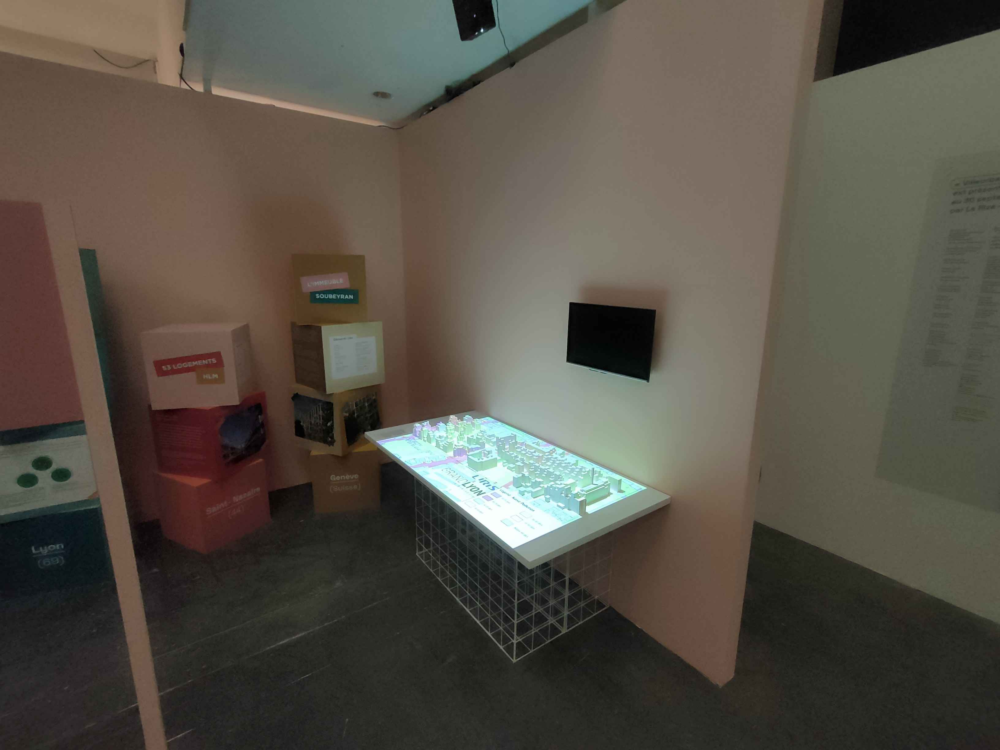
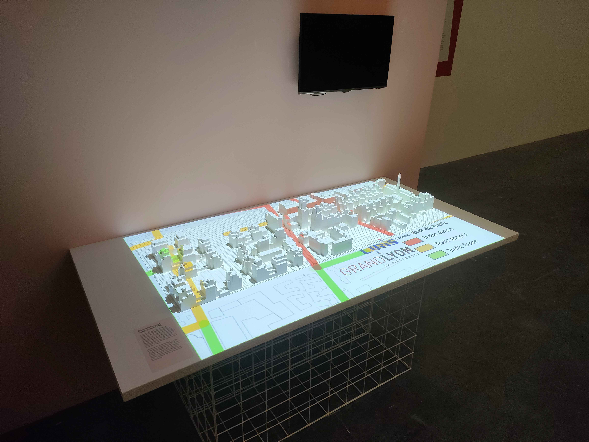
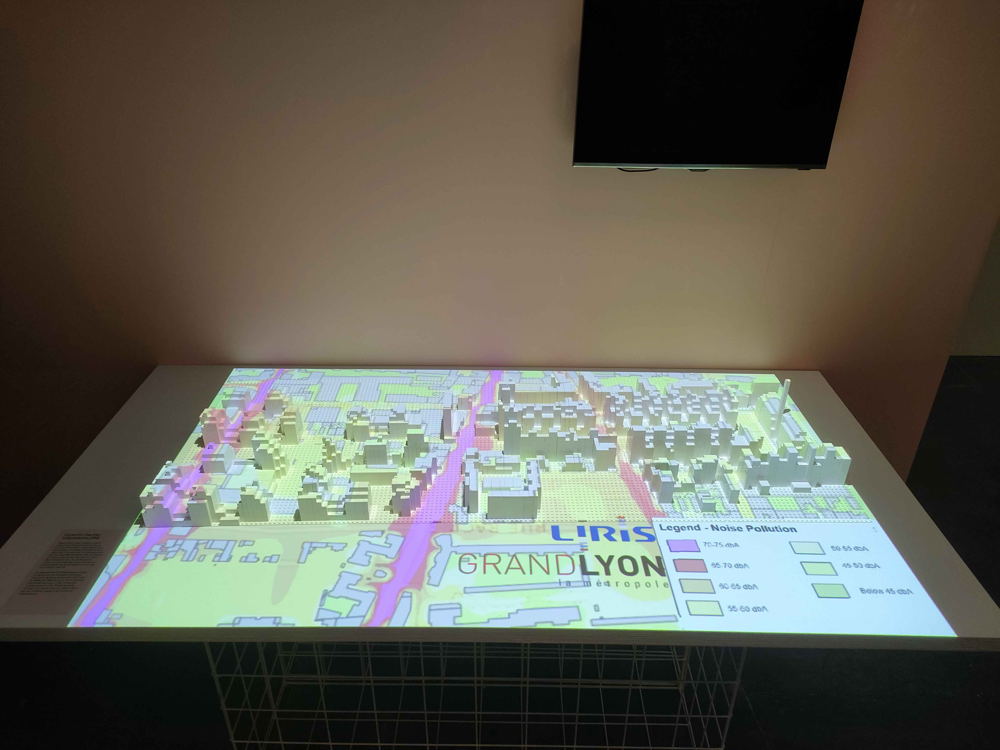

# Atelier au Rize
## Villeurbanne à tous les étages
Les travaux de recherche de Corentin Gautier, membre de l'équipe Origami, ont été intégrés dans l'exposition "Villeurbanne à tous les étages" présentée au [Le Rize](https://lerize.villeurbanne.fr) du 14/11/24 au 30/09/25. 
En se concentrant sur le logement collectif, Corentin a intégré ses études sur les maquettes augmentées dans cette installation.
L'exposition met en avant une maquette en Lego du quartier Gratte-Ciel, enrichie par une projection de données urbaines. Ce dispositif interactif vise à rendre les concepts d'urbanisme plus accessibles et engageants pour le public. Les visiteurs peuvent explorer les enjeux urbains de manière ludique et immersive, illustrant ainsi l'application concrète des recherches de maquette augmentée.

## Version corrigée (JDE)
Les travaux de thèse menés dans l'équipe Origami par Corentin Gautier (encadré par Gilles Gesquiere et Johanna Delanoy) sont présentés dans l'exposition "Villeurbanne à tous les étages" au centre d'exposition [Le Rize](https://lerize.villeurbanne.fr) du 14/11/24 au 30/09/25. L'exposition se focalise sur le logement collectif et a intégré une maquette augmentée conçue par l'équipe. L'exposition met ainsi en avant une maquette en Lego du quartier Gratte-Ciel, enrichie par une projection de données urbaines. Ce dispositif interactif vise à rendre les concepts d'urbanisme plus accessibles et engageants pour le public. Les visiteurs peuvent explorer les enjeux urbains de manière ludique et immersive, illustrant ainsi l'application concrète des recherches de maquette augmentée.

||||
|----|----|----|
||||
