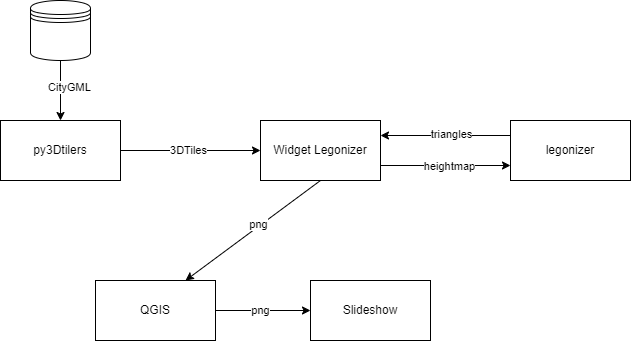

# Projet de recherche Maquette augmentée

## Problematique
- Comment le tangible peut guider le numérique ? 

## Conception
### Schemas
|Parcours utilisateurs | Briques logiciels|
|---|---|
|||

### Data to integrate
Versions :
- 1930 : Création des bâtiments iconiques de Gratte-ciel
- 1963 : Apparition de la synagogue
- 2004 : Modification de la place derrière l'hotel de ville
- 2009 : Création de bâtiments
- 2018 : Destruction du lycée etc
- 2025 : Création du premier ilôt
- 2026 : Création du deuxième ilôt
- 2027 : Création des derniers ilôts

Multimédia :
- Hotel de ville : inscrit à l'inventaire des monuments historiques / pietonisation de l'avenue (calques des routes)
- Le nouveau quartier : document de la création du lycée (calques des établissement publics) / Destruction du lycées (calques des travaux ?) / construction des ilots (calques des différents ilots et leur toit végétalisé ?) 
- Les gratte-ciel : photos de leur création (calques qui montre quelle partie est crée) / les usages actuels (calques habitations / commerces) / les espaces végétalisés (calques de végétalisation).

<!-- ### Données de simulation: LMA (D)
 Veille sur les types de données utilisés par les outils de visualisations de simulation. Une passerelle entre py3dtilers et ces outils peut être créée. Les outils de visualisation sont VTK, ParaView et SLAM. VTK a une adaptation js qui peut être le lien avec le 3DTiles. ParaView et SLAM sont des logiciels écrit en C/C++, le lien avec les technologies web est plus complexe à faire. Ils utilisent des types de formats de simulations qui peuvent être transformé dans des formats plus adapté pour les librairie. -->

<!-- ### Veille AR/VR en JavaScript: MLI (D)
Une amélioration du dispositif de maquette augmentée est envisagée en utilisant de la réalité augmentée ou de la réalité virtuelle. Cette augmentation permet d'ajouter plus d'information à la maquette urbaine, tel que des données de simulation 3D qui ont besoin d'une visualisation dans l'espace 3D. L'objectif est de faire une veille sur les technologies existantes sur la visualisation AR et VR dans un contexte web. Le contexte web est necessaire pour une intégration avec la librairie de visualisation de donnée géospatiale itowns. Il facilitera l'intéraction entre la maquette physique et numérique.

### Lier maquette tangible et numérique: MLI-LMA-CGA (D)
La maquette augmentée est composé de la maquette physique sur laquelle nous projetons de la donnée de calque par dessus pour ajouter plus de contexte au quartier visualisé. Un écran est également placé en amont de la représentation tangible pour apporter d'autres informations sur le territoire. Notre objectif est de lier maquette numérique et maquette tangible afin de créer un outil plus intéractif et impliquer l'utilisateur. Ce lien est imaginé à travers une coupe de la maquette numérique que l'on va ensuite projeté sur la partie tangible. Cette coupe peut être une couche de propagation de fumée d'un incendie à une certaine altitude. Le choix de la coupe est envisagé à travers un slider physique sur la table ou est posé la maquette du territoire. Le slider déplace la coupe sur l'axe z. -->

<!-- ### Rendre visible l'invisible: CGA (R)
- Recherche rendre visible l'invisible avec une veille scientifique [lien de la page projet](./Readme.md). CGA (R) -->
## TO-DO
- [ ] icone de camera quand on est en mode multimédia pour montrer le point de vue
- [ ] Changer l'orientation de la vue pour rester cohérent avec la maquette

## Objectif de thèse de CGA
- Lier maquette tangible à la maquette numérique.  
    - La maquette tangible pour créer des scénario d'urbanisation d'un quartier. 
    - Capter des changements sur la maquette lego.
    - Montrer les évolutions d'un quartier sur la maquette tangible. 

- Lier l'extent avec la maquette tangible et les données géospatiales. 

- Pour un public d'expert créer des scénario qu'on peut retrouver.
- Pour le grand public c'est de la médiation scientifique donc du feedback immédiat. 

1. Capter des changements sur la maquette.
    - Lego de couleur.
    - Changement de position d'un bâtiments.
2. Reproduire ces changements sur la maquette numérique.
3. Mettre à jour la projection en fonction des changements physiques.  
3. Créer des scénarios 

## L'objectif pour IMU
- Projeter des données de simulation sur leur maquette Gratte-Ciel. 
Lié leur outil de simulation Slam au systeme de projection sur une maquette physique. 
SLAM est un logiciel de dispersion lagrangien adapté pour les problématiques d'impact industrie. Il permet le calcul de concentration de polluants à partir de champs de vent 3D calculés avec un outil CFD (mécanique des fluides numérique). 

## Membres

- **Lead**: CGA 
- Technical support: MLI
- Technical support: LMA

Concerned parties: [IMU](https://imu.universite-lyon.fr/imu-fr/).

## Roadmap

## Ongoing action

## What was done
- [Legonizer algorithm](https://github.com/VCityTeam/Legonizer) (npm package)
- [UD-Viz legonizer interface](https://github.com/VCityTeam/UD-Viz/tree/legonizer) (the integration of the algorithm within UD-Viz)
## References

### Research references
- [Spatial augmented reality for physical drawing](https://theses.hal.science/tel-00935602v2)
- [Hiroshi Ishii – MIT Media Lab](https://www.media.mit.edu/people/ishii/overview/)
- [TerraGuide: Design and Evaluation of a Multi-Surface Environment](https://www.youtube.com/watch?v=iKrPvpeWi_Y)
- [DEFFINUM - OpenXR Co location](https://bookmark-cafoc.gipftlv-bourgogne.fr/portfolios/deffinum/)
- [MARIO: Mid-air Augmented Reality Interaction with Objects](https://www.sciencedirect.com/science/article/abs/pii/S1875952114000433?casa_token=HqHT_A8u874AAAAA:_DxBSwo9ficeuwaiT_hZf7bUhRYQUe0XCjVsS8Ut3vra36VFvvR6KUxwMPGNAP7mryYjWgQtwwvT#f0015)
- [Tangible 3D Urban Simulation Table](https://www.ngv.vic.gov.au/exhibition_post/tangible-3d-urban-simulation-table/)

### Technical references
- [PapARt Library](https://github.com/natar-io/PapARt)
- [AR.js](https://ar-js-org.github.io/AR.js/)
- [QR Scanner](https://github.com/nimiq/qr-scanner)
- [Instascan](https://github.com/schmich/instascan)
- [VTKjs](https://github.com/kitware/vtk-js): librairy de visualisation de donnée médicale. Ressemble à ThreeJs mais se base sur du WebGL différent avec des usages pour différent public. 
## What will be done

## Topic meetings
- [2024 03 12: MLI LMA CGA](./../../../../Topic_Meetings/2024/2024_03_12_MLI_LMA_CGA.md)
