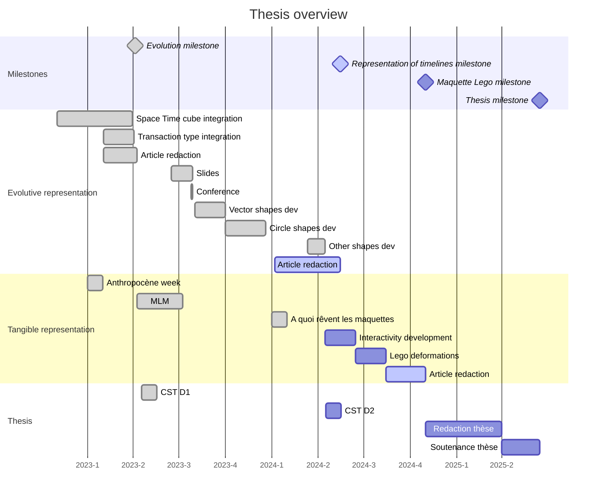

# Représentations dynamiques, virtuelles et tangibles de la ville
- [Manuscrit de thèse (Overleaf)](https://www.overleaf.com/project/64ef0c820620f08cdc01db90)
- [UD-Demo-TIGA-Morphogenese](https://github.com/VCityTeam/UD-Demo-TIGA-Morphogenese-Lyon) (Berliet)
- [Anthropocene week 2023](../Anthropocene_2023/Readme.md)

Thesis overwiew made by [JPU](../UD-Evolution-PhD-2023_2026/Readme.md)

*** 
- [Context](#context)
- [Members](#members)
- [Jury Members](#jury-members)
- [To-Do](#to-do)
- [Research mature topics](#research-mature-topics)
	- [Project pages](#project-pages)
		- [Integrating Multimedia for augmented models](./Projets/IntegrationMultimedia/Readme.md)
		- [Representation of Evolutive 3D urban data](./Projets/EvolutionTemporelle/Evolution_Temporelle.md)
		- [Tangible representation](./Projets/Maquette/Readme.md)
	- [Articles](#articles)
		- [Representation of urban geometry evolution through space-time cube](./../../articles/CGA-Morphogene-2023/main.pdf)
		- [Integrating multimedia documents for augmented models to a better understanding of its territory](./../../articles/SDSC-Gautier-2022/main_commented.pdf)
		- [Evolutive 3D Urban Data Representation through Timeline Design Space](https://www.overleaf.com/project/664c53a6fb5f9a87624e1eb4) *Waiting reviews*
 <!-- - [Maturing project](#maturing-topics) -->
 - [Planning](#planning)
 - [Applicative projects](#applicative-projects)
 - [CST](#comité-de-suivi-de-thèse)
	- [D1](./CST/CST-1-year.md)
	- [D2](./CST/CST-2-year.md)
 - [Bibliography](#bibliography)
 	- [Tangible table](Bibliographie.md#tangible-table)
	- [Temporal visualisation](Bibliographie.md#temporal-visualisation)
	- [Data structure](Bibliographie.md#data-structure)
	- [Stylisation](Bibliographie.md#stylization)
	- [Digital twins](Bibliographie.md#digital-twins)
 - [Topic mettings](https://github.com/VCityTeam/VCity/tree/master/Projects/Phd_Corentin_Gautier#topic-meetings)
***
## Context
Cette thèse s'intégre dans le projet de recherche du LIRIS [Virtual city](https://projet.liris.cnrs.fr/vcity/). Ce projet a pour but d'utiliser les données géospatiales urbaines dans un contexte pluridiciplinaire pour la compréhension de l'évolution de la ville.
Cette thèse est en partie financé par le [labEx IMU](https://imu.universite-lyon.fr/) dans le cadre du projet [TIGA](../TIGA/readme.md). Ce projet permet d'offir à la thèse des cas d'applications des travaux de recherches. 
## Members
| Author		 | Thesis supervisor | Thesis co-supervisor |
|:--------------:|:--------------:|:--------------:|
|[Corentin GAUTIER](https://liris.cnrs.fr/page-membre/corentin-gautier)	|[Gilles GESQUIERE](https://liris.cnrs.fr/page-membre/gilles-gesquiere)	| [Johanna DELANOY](https://liris.cnrs.fr/page-membre/johanna-delanoy)|

## Ongoing project
- [Maquette augmentée](./Projets/Maquette/Readme.md)

## TO-DO
### Dossier de Soutenance
- [X] Liste détaillée de publications avec les noms complets des auteurs et en précisant le type : revues, conférences, ateliers, etc.. En informatique, il faut avoir au moins une publication internationale de qualité.
- [X] Lettre de soutien pour la soutenance de la part du directeur de thèse. En informatique, cette lettre doit aussi appuyer la qualité de la publication du doctorant.
- [X] Lettre du directeur de thèse motivant le choix du jury et des rapporteurs.
- [X] L'avis du directeur de laboratoire.
- [X] Un résumé de la thèse.
- [X] Mettre un lien ou votre manuscrit de thèse peut être consulté par la commission des thèses. On pourra utiliser un serveur de fichiers (par exemple https://filesender.renater.fr/) ou une page web.
- [X] Un C.V. du candidat.
- [X] Récapitulatif des formations doctorales suivies téléchargé depuis ADUM

## Research mature topics
### Project pages
- [Spatio temporal representation](./Projets/EvolutionTemporelle/Evolution_Temporelle.md)
- [Integrating Multimedia in a 3D space](./Projets/IntegrationMultimedia/Readme.md)
- [Tangible representation](./Projets/Maquette/Readme.md)

### Articles
- [Representation of urban geometry evolution through space-time cube](./../../articles/CGA-Morphogene-2023/main.pdf)
- [Integrating multimedia documents for augmented models to a better understanding of its territory](./../../articles/SDSC-Gautier-2022/main_commented.pdf)
- [Evolutive 3D Urban Data Representation through Timeline Design Space](https://www.overleaf.com/project/664c53a6fb5f9a87624e1eb4)

<!-- ## Maturing topics 
- [Stylisation](Concepts/Stylisation.md)
- [Maquette hybride](Concepts/HybrideModel.md)
	- Penser papier pour les futurs works.
	- Discrétisation des legos. Comment les transformer. 
	- avec du double projecteur. Selection du quartier en decalent des bâtiments. Comment mettre le projecteur en fonction des ombrages.
	- Comment discretiser pour l'outil de médiation ou pour qu'elle soit le plus propre possible. -->

## Planning 

## Applicative projects 
- [UD-Demo-TIGA-Morphogenese](https://github.com/VCityTeam/UD-Demo-TIGA-Morphogenese-Lyon) (Berliet)
- [Anthropocene week 2023](../Anthropocene_2023/Readme.md) 

## Comité de suivi de thèse
- [1er année](./CST/CST-1-year.md)
- [2eme année](./CST/CST-2-year.md)
## Bibliography
- [Tangible table](Bibliographie.md#tangible-table)
- [Temporal visualisation](Bibliographie.md#temporal-visualisation)
- [Data structure](Bibliographie.md#data-structure)
- [Stylisation](Bibliographie.md#stylization)
- [Digital twins](Bibliographie.md#digital-twins)

## Student projects:
* [WPI internship](./Projets/Maquette/StudentProject/WPI_BeyondLego.md) :

## Formations doctorales
### 2024/2025
* [Ethique et Intégrité scientifique](https://www.fun-mooc.fr/fr/cours/ethique-de-la-recherche/) : 15h
* [Les journées Françaises de L'informatique Graphique](https://jfig2024.icube.unistra.fr) : 21h
### 2023/2024
* Gestion des conflits et des personnalités difficiles : 14h 
* Préparation au concours Ma thèse en 180 secondes : 12h
* Créer un dispositif de médiation scientifique : 24h
* Organisation de la journée scientifique de l'ED : 20h

Total d'heures de formations: 112h
## Topic meetings

 2023

	<li><a href="../../Topic_Meetings/2023/2023_07_25_Tutoriel_Conference_IV23.md">2023 07 25: Tutoriel Conférence IV23</a></li>
	<li><a href="../../Topic_Meetings/2023/2023_07_07_retours_presentation_CGA_JDE_GGE.md">2023 07 07: Retours présentation CGA</a></li>
	<li><a href="../../Topic_Meetings/2023/2023_06_06_Webinaire_LIDAR_HD.md">2023 06 06: Webinar LIDAR HD</a></li>
	<li><a href="../../Topic_Meetings/2023/2023_06_06_CoTech_TIGA.md">2023 06 06: Cotech TIGA</a></li>
	<li><a href="../../Topic_Meetings/2023/2023_05_31_Conseil_ED.md">2023 05 31: Conseil de l'ED</a></li>
	<li><a href="../../Topic_Meetings/2023/2023_05_23_JDE_CGA_LMA_JPE.md">2023 05 23: Point Stagiaire JPE w/ LMA + JDE + CGA</a></li>
	<li><a href="../../Topic_Meetings/2023/2023_05_22_seminaire_violette_abergel.md">2023 05 22: Séminaire Viollete Abergel</a></li>
	<li><a href="../../Topic_Meetings/2023/2023_05_16_reunion_equipe_IMU.md">2023 05 16: Réunion d'équipe IMU</a></li>
	<li><a href="../../Topic_Meetings/2023/2023_05_15_Retour_PopSciences.md">2023 05 15: Retours PopSciences</a></li>
	<li><a href="../../Topic_Meetings/2023/2023_04_18_Beyond_Lego.md">2023 04 18: Beyond lego</a></li>
   <li><a href="../../Topic_Meetings/2023/2023_04_06_CGA_CPE_VTE.md">2023 04 06: Point maquette CGA CPE VTE</a></li>
   <li><a href="../../Topic_Meetings/2023/2023_03_23_Article_Review_CGA_GGE_JDE.md">2023 03 23: Article Review CGA GGE JDE</a></li> 
   <li><a href="../../Topic_Meetings/2023/2023_03_17_Article_GGE_JDE_CGA.md">2023 03 17: Point Article CGA JDE GGE</a></li>
   <li><a href="../../Topic_Meetings/2023/2023_03_16_CGA_EBO_sur_UML.md">2023 03 16: Point CGA EBO w/DVA</a></li>
   <li><a href="../../Topic_Meetings/2023/2023_03_07_Exodev_JSA_CGA_EBO.md">2023 03 07: Point ExoDev JSA CGA EBO</a></li>
   <li><a href="../../Topic_Meetings/2023/2023_03_03_Point_Th%C3%A8se_CGA_JDE.md">2023 03 03: Point thèse JDE CGA</a></li>
   <li><a href="../../Topic_Meetings/2023/2023_02_23_Point_CGA_GGE.md">2023 02 23: Point GGE CGA</a></li>
   <li><a href="../../Topic_Meetings/2023/2023_02_20_Point_CST_DVA_CGA.md">2023 02 20: Point CST DVA CGA</a></li>
   <li><a href="https://docs.google.com/spreadsheets/d/1KGFYuOoBkRX-7GGFmghbYwsakSaWKQzunSZEEnpo-EA/edit#gid=0">2023 02 16: Point thèse JDE CGA</a></li>
   <li><a href="../../Topic_Meetings/2023/2023_02_10_Point_Morphogenesis_CGA_JDE_GGE.md">2023 02 10: Point Morpho</a></li>
   <li><a href="../../Topic_Meetings/2023/2023_02_02_Point_th%C3%A8se_JDE_CGA.md">2023 02 02: Point thèse GGE JDE CGA</a></li>
   <li><a href="../../Topic_Meetings/2023/2023_01_20_Point_th%C3%A8se_CGA_JDE_GGE.md">2023 01 20: Point thèse GGE JDE CGA</a></li>
   <li><a href="../../Topic_Meetings/2023/2023_01_20_Discussion_Ergonomie_Maquette_CGA_EGO.md">2023 01 20: Discussion Ergonomie maquette avec EGO</a></li>
   <li><a href="../../Topic_Meetings/2023/2023_01_06_Journ%C3%A9e_boite_a_outil_cartographie.md">2023 01 06: Journée boite à outils de la cartographie</a></li>
   <li><a href="../../Topic_Meetings/2023/2023_01_05_Point_th%C3%A8se_JDE_CGA.md">2023 01 05: Point thèse CGA JDE</a></li>

 2022

    <li><a href="../../Topic_Meetings/2022/2022_12_15_Point_th%C3%A8se_JD_CGA.md">2022 12 15: Point thèse CGA JDE</a></li>
    <li><a href="../../Topic_Meetings/2022/2022_12_06_CGA_DVA.md">2022 12 06: Point morphogénèse DVA CGA</a></li>
    <li><a href="../../Topic_Meetings/2022/2022_11_29_Point_thèse_JDE_GGE_CGA.md">2022 11 29: Point planification GGE JDE CGA</a></li>

## Jury Members
- [Christophe Jouffrais](https://www.irit.fr/~Christophe.Jouffrais/) : Examinateur - ✅
- [Valérie Gouet-Brunet](https://www.umr-lastig.fr/vgouet/) : Rapportrice - ✅
- [Mathieu Brédif](https://www.umr-lastig.fr/mathieu-bredif/) : Examinateur - ✅
- [Myriam Servière](https://aau.archi.fr/equipe/servieres-myriam/) : Rapportrice - ✅
- [William Puech](https://scholar.google.com/citations?user=es0QRS4AAAAJ&hl=fr) : Examinateur - ✅
